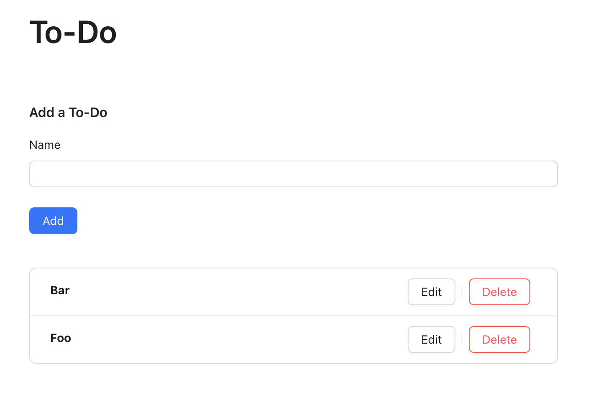
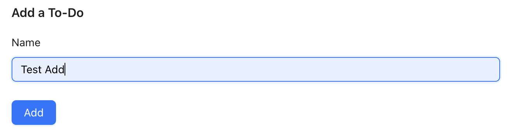
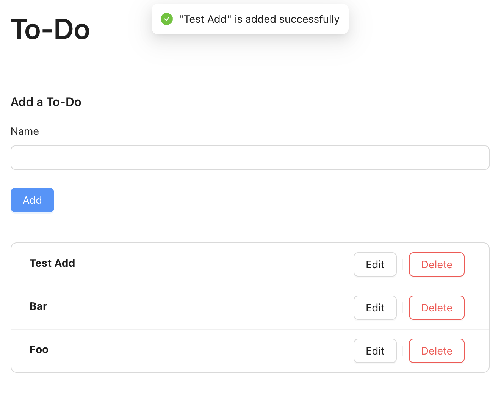
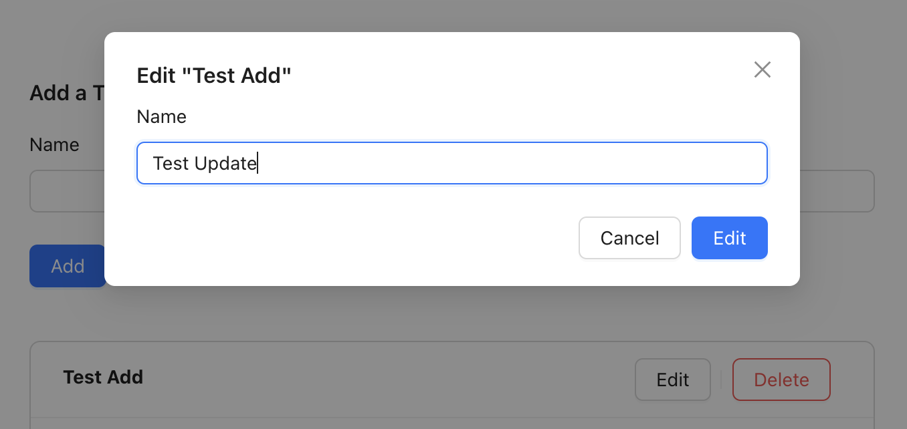
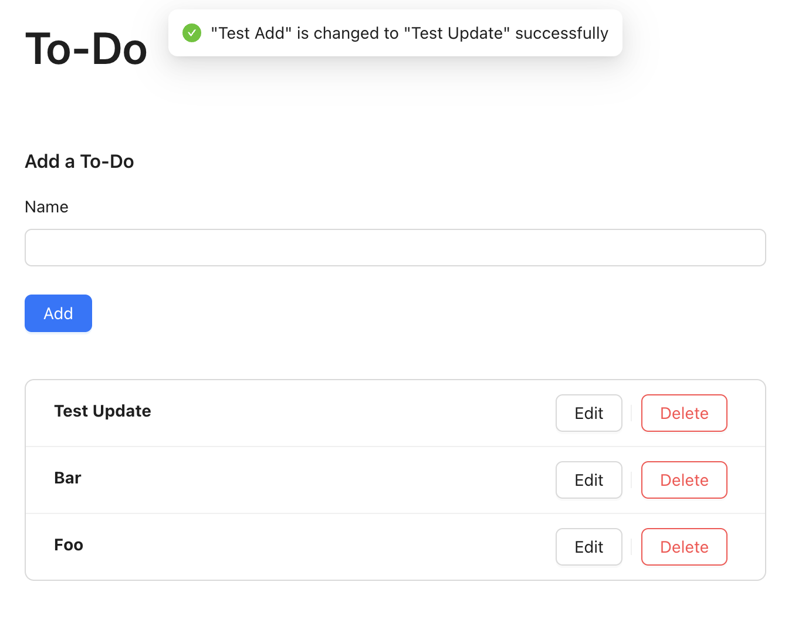
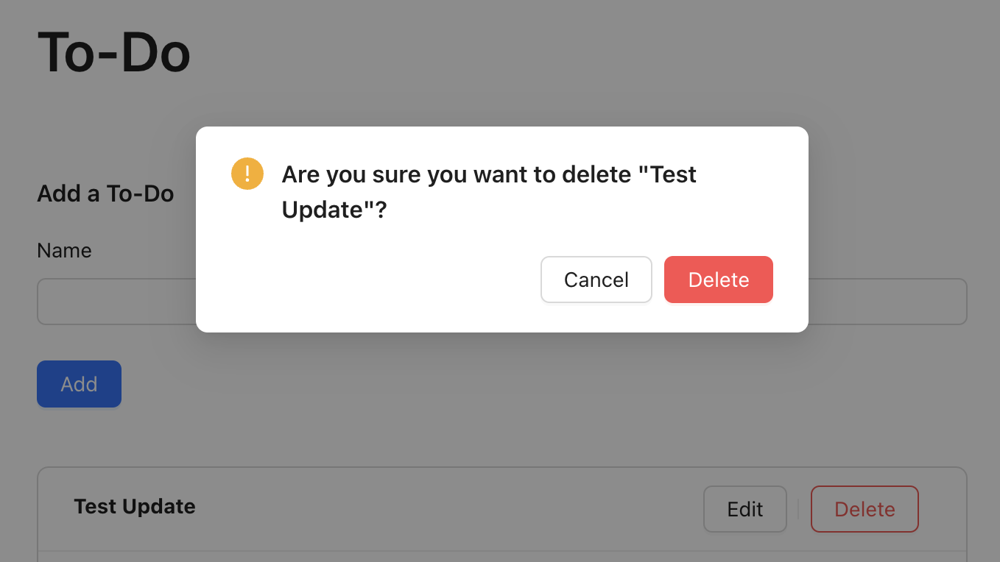
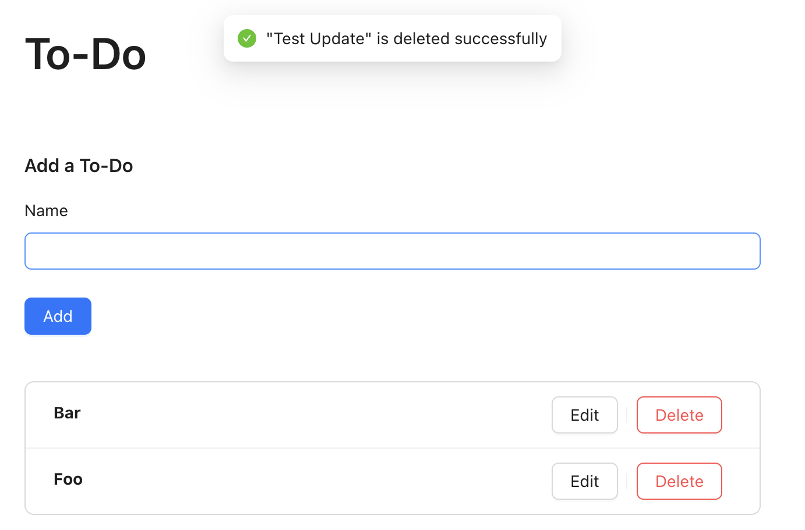

# To-Do Web App

This project is a basic CRUD web app for To-Do items. User can create a new To-Do, update an existing To-Do, delete an existing To-Do, as well as viewing all To-Dos.

The frontend app is implemented with React, and Ant Design is used as the UI component library. The backend app is implemented with Express, and PostgreSQL is used as the database.

## Frontend

The frontend project is located in the `frontend` folder. All the below commands assume the `frontend` folder is the current folder.

### Build

Run `npm ci` to install all npm dependencies.

Before building the app, some environment variables need to be set. For frontend, the following are required -

- `REACT_APP_SERVER_DOMAIN` - The server domain for the backend. It should be `http://localhost:8080` if the backend server is running on the same machine as the frontend.

The prefix `REACT_APP` is needed for `Create React App` to recognize it.

To add the environment variables, create a `.env` file in the `frontend` folder and add the variables' key and value. Example `.env` file -

```
REACT_APP_SERVER_DOMAIN=http://localhost:8080
```

Once the `.env` is created, use `npm run build` to make a production build. The output is generated under the `build` folder.

### Serve

Use `npm run serve` to start a local server. `http-server` is used. The frontend app will be available on `http://localhost:3000`.

### Test

Use `npm run test` to run all test cases. `Jest` is the test runner. `React Testing Library` is used for UI automations. `msw` is used for setting up mock server which intercepts all API requests and return mock responses.

### Usage

The frontend app consists of a single page only. Initially the list of To-Dos will be fetched and displayed on the homepage.



There are various kinds of operation can be done.

#### Add a To-Do

There is a `Add a To-Do` section in the homepage. Under this section, type a preferred name for the To-Do, then click the `Add` button.



After it is added successfully, a pop-up message will appears at the top of the page. The To-Do list will be reloaded. The newly added To-Do should be displayed as the first item in the list.



#### Edit a To-Do

There is an `Edit` button on every To-Do item in the list. On the item to be updated, click the `Edit` button, a modal will be opened.

Inside the modal, type a preferred name for updating the To-Do, then click the `Edit` button.



After it is updated successfully, a pop-up message will appears at the top of the page. The To-Do list will be reloaded. The To-Do should be updated with the new name.



#### Delete a To-Do

There is a `Delete` button on every To-Do item in the list. On the item to be deleted, click the `Delete` button, a modal will be opened.

The modal prompts for the confirmation to delete the To-Do. To proceed, click the `Delete` button in the modal.



After it is deleted successfully, a pop-up message will appears at the top of the page. The To-Do list will be reloaded. The To-Do should no longer be displayed in the list.



## Backend

The backend project is located in the `backend` folder. All the below commands assume the `backend` folder is the current folder.

### Build

Run `npm ci` to install all npm dependencies.

Before building the app, some environment variables need to be set. For backend, the following are required -

- `POSTGRES_HOST` - The host for the PostgreSQL database. It should be `localhost` if the database is running on the same machine as the backend.
- `POSTGRES_PORT` - The port that the PostgreSQL database is running on. Depending on the database setup, usually it should be `5432` by default.
- `POSTGRES_DB` - The name of the database to connect.
- `POSTGRES_USER` - The user name to be used to login the database.
- `POSTGRES_PASSWORD` - The password for the database user.

To add the environment variables, create a `.env` file in the `backend` folder and add the variables' key and value. Example `.env` file -

```
POSTGRES_HOST=localhost
POSTGRES_PORT=5432
POSTGRES_DB=postgres
POSTGRES_USER=postgres
POSTGRES_PASSWORD=postgres
```

Once the `.env` is created, use `npm run build` to make a production build. The output is generated under the `dist` folder.

### Serve

A PostgreSQL database with a table is required for the backend app to function correctly. For table creation, there is a `create_table.sql` script located in the `db` folder for this purpose. One can use `psql` to run the script, example for running on Mac/Linux -

```
psql -h {POSTGRES_HOST} -p {POSTGRES_PORT} -U {POSTGRES_USER} -d {POSTGRES_DB} -a -f db/create_table.sql
```

For Windows, file paths use backslash (\\) instead of forward slash (/) so the script path needs to be adjusted, i.e. `db\create_table.sql`.

Once the database setup is done, use `npm run serve` to start the backend server. The backend server will be listening on `http://localhost:8080`.

### Test

Use `npm run test` to run all test cases. `Jest` is the test runner. `supertest` is used to simulate API requests and make assertions for the responses.

### Usage

The backend app consists of 4 API routes which are responsible for CRUD operations -

- `GET /todo/all` - List all To-Do items
- `POST /todo` - Create a To-Do
- `PUT /todo/:id` - Update a To-Do by its `id`
- `DELETE /todo/:id` - Delete a To-Do by its `id`

#### `GET /todo/all`

For request, no params or body are required. Example cURL request:

```
curl -X GET 'http://localhost:8080/todo/all'
```

For response, an object with `results` being the array of items will be returned. Example response body:

```
{
  results: [
    {
      id: "1",
      name: "Example"
    }
  ]
}
```

#### `POST /todo`

For request, `name` is required in the request body. No params needed. Example cURL request:

```
curl -X POST 'http://localhost:8080/todo' \
-H 'Content-Type: application/json' \
-d '{"name": "Create"}'
```

For response, the created item will be returned. Example response body:

```
{
  id: "2",
  name: "Create"
}
```

#### `PUT /todo/:id`

For request, `id` is required as the path parameter. `name` is required in the request body. Example cURL request:

```
curl -X PUT 'http://localhost:8080/todo/2' \
-H 'Content-Type: application/json' \
-d '{"name": "Update"}'
```

For response, the updated item will be returned. If the `id` does not exist, no items will be updated and status `404` will be returned. Example response body:

```
{
  id: "2",
  name: "Update"
}
```

#### `DELETE /todo/:id`

For request, `id` is required as the path parameter. No body is required. Example cURL request:

```
curl -X DELETE 'http://localhost:8080/todo/2'
```

For response, an object with the deleted `id` will be returned. If the `id` does not exist, no items will be deleted and status `404` will be returned. Example response body:

```
{ id: "2" }
```
